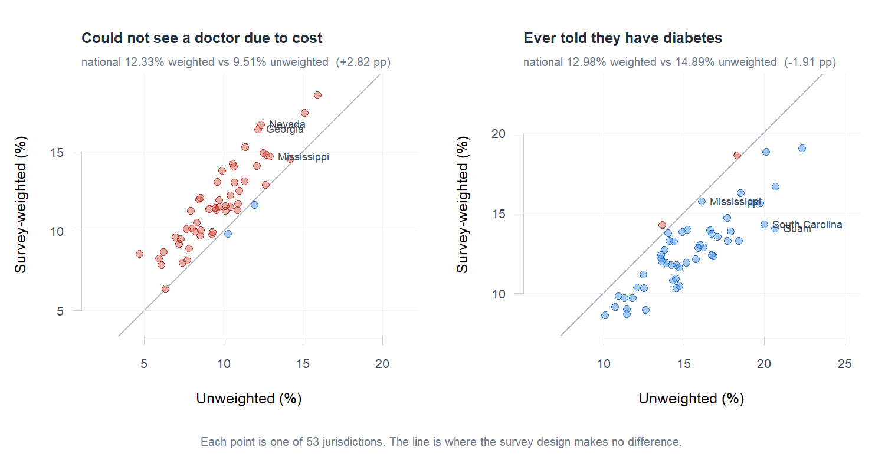

# Population Health Survey Analytics (R)

Survey-weighted prevalence estimation on the **CDC BRFSS 2024 public-use file** — 457,670
respondents across 53 jurisdictions — computed twice: once respecting the complex survey design,
once ignoring it. The gap between them is the finding.



**Real public data**, downloaded from the CDC at build time. No synthetic generation, and nothing
private: BRFSS public-use files carry no identifiers.

---

## Run it

Needs R 4.x. Nothing else — `run.R` installs `haven` and `survey` into your user library if they
are missing, and downloads the data itself.

```bash
git clone https://github.com/gadesaiharika/population-health-survey-analytics
cd population-health-survey-analytics
Rscript run.R
```

About 13 minutes later you have estimates, 41 passing validation checks, and three CSVs in
`data/exports/`.

```
[1/5] Ingesting BRFSS 2024
       457,670 rows x 301 columns in 42s
[3/5] Estimating prevalence
       national: cost_barrier (variance over 43,913 sampling units, slow)
         12.3% weighted vs 9.5% unweighted in 332s
       per-jurisdiction: cost_barrier
         53 jurisdictions in 11s
[4/5] Validating
       41 passed, 0 failed
OK - built, validated, and exported in 760s
```

The download, the prepared frame, and the estimates are all cached. `--validate-only` re-runs the
checks in seconds, `--export-only` rewrites the CSVs, `--refresh` rebuilds from scratch, and
`--year 2023` runs a different BRFSS year.

---

## What it found

**Ignoring the survey design does not bias estimates in a consistent direction.**

| Measure | Unweighted | Weighted (95% CI) | Gap |
|---|---:|---:|---:|
| Could not see a doctor in the past 12 months due to cost | 9.5095% | **12.3338%** (12.1055–12.5621) | **+2.8243 pp** |
| Ever told they have diabetes | 14.8911% | **12.9807%** (12.7570–13.2044) | **−1.9104 pp** |

One measure is understated by ignoring the design and the other is overstated. There is no
correction factor and no safe rule of thumb: the direction depends on how the measure correlates
with who was oversampled. A single measure would have suggested a tidy bias; two measures show
there isn't one.

**State rankings move enough to change what a reader concludes.**

| | Cost barrier | Diabetes |
|---|---:|---:|
| Median absolute rank shift (of 53) | 5.0 places | 6.0 places |
| Jurisdictions moving ≥ 10 places | 8 | 16 |
| Largest single move | Pennsylvania, −18 | **Nevada, +28** |
| Mean absolute difference | 2.01 pp | 2.65 pp |
| Largest difference | Nevada, 4.35 pp | Guam, 6.63 pp |

**Mississippi** makes the point concretely. On diabetes it reads **16.10% and 20th** unweighted,
**15.71% and 6th** weighted — same data, same year, a fourteen-place difference in where the state
sits. On the cost barrier it moves the other way: **12.91% and 4th** unweighted, **14.68% and 8th**
weighted.

---

## How it works

```
CDC zip → XPT → analysis frame → svydesign → national + 53 jurisdictions → 41 checks → CSVs
```

| Path | |
|---|---|
| `run.R` | one command: ingest → prepare → estimate → validate → export |
| `R/ingest.R` | download, cache, unzip, `read_xpt` |
| `R/prepare.R` | column map, `MEASURES` specs, recode, cached frame |
| `R/estimate.R` | `svydesign`; national and per-jurisdiction, weighted and unweighted |
| `R/validate.R` | the 41 checks |
| `R/export.R` | three CSVs |
| `R/figure.R` | the README figure and the state-level numbers |
| `R/reconcile.R` | compares SAS output against R output |
| `sas/01_estimate.sas` | the `PROC SURVEYFREQ` equivalent — see the SAS section below |

The core call is three lines, and every one of them is load-bearing:

```r
options(survey.lonely.psu = "adjust")
svydesign(ids = ~psu, strata = ~stratum, weights = ~weight, data = d, nest = TRUE)
```

### Five things that will bite anyone doing this

1. **`mode = "wb"` on the download.** Without it, Windows performs newline translation on a binary
   zip and `unzip()` fails with an error that points nowhere near the cause.
2. **The XPT filename can carry a trailing space.** CDC has shipped `"LLCP2023.XPT "`. Read the
   member name out of the archive and trim it; never hardcode it.
3. **`nest = TRUE` is mandatory, and the reason is counter-intuitive.** BRFSS PSU identifiers are
   unique only *within* a stratum — **25,800 of 43,913 appear in more than one**. Without nesting,
   `survey` treats same-numbered PSUs in different strata as one cluster and the variance is wrong
   while the point estimate still looks fine.
4. **`svyby` on the national design is unusably slow, and unnecessary.** It subsets a
   457,670-row, 43,913-PSU design 53 times per measure. Building one design per jurisdiction is
   **exact, not an approximation**, because no stratum spans a jurisdiction boundary — which is
   itself a validation check. The state step takes 11 seconds instead of running past 25 minutes.
5. **`survey.lonely.psu = "adjust"`.** Some strata contribute a single PSU and have no
   within-stratum variance. Without this the run either errors or silently drops them.

And the one that silently changes an answer: **7 = "don't know" and 9 = "refused"** appear on almost
every BRFSS question. Folding them into "no" is the most common way to understate a prevalence. They
leave the denominator, and a check asserts it. Diabetes additionally drops **2** ("yes, but only
during pregnancy") and **4** ("no, pre-diabetes or borderline") — neither is a yes or a no.

---

## Validation

`Rscript run.R --validate-only` runs 41 checks in four groups.

| Group | Checks | What it protects |
|---|---:|---|
| Design integrity | 11 | the file is shaped the way the estimator assumes |
| Recode integrity | 10 | every respondent is a yes, a no, or deliberately nobody |
| National estimates | 8 | the arithmetic is internally consistent |
| State estimates | 12 | 53 parts reconcile back to the whole |

A survey estimate is the kind of number nobody can eyeball — 12.3% and 9.5% look equally plausible,
and the difference between them is whether the design was declared correctly. Two checks are worth
calling out:

- **State estimates re-weight back to the national figure.** Re-weighting the 53 jurisdiction
  estimates by their share of total weight reproduces the national number exactly (difference
  0.00e+00 pp). If the per-jurisdiction shortcut were ever wrong, this is where it would show.
- **Weighting materially changes the estimate.** This asserts the project's own premise. If
  weighting ever stopped mattering there would be nothing here to report, and the build should say
  so rather than publish an empty finding.

---

## The SAS half — written, not yet run

`sas/01_estimate.sas` implements the same analysis with `PROC SURVEYFREQ`, and `R/reconcile.R`
compares the two to a **0.01 percentage point** tolerance.

**It has not been executed.** It needs a SAS OnDemand for Academics account, and until it runs, this
repository is an R project with a SAS program beside it — not a cross-validated one. That
distinction is the whole reason this section exists rather than a claim in the summary.

The asymmetry is what makes the check worth running: `PROC SURVEYFREQ` nests clusters inside strata
by default, so SAS has no equivalent of `nest = TRUE` to forget, while SAS will happily treat 7 and
9 as ordinary values if the recode is sloppy. The two tools fail in different places, so agreement
between them is worth more than either alone. See `sas/README.md`.

---

## Limitations

- **Self-reported.** BRFSS asks; it does not measure. "Ever told they have diabetes" is a question
  about diagnosis and recall, not prevalence in the clinical sense.
- **Landline and cellular adults only**, 18+, non-institutionalised. People without phones, in
  prisons, or in nursing homes are out of frame entirely — weighting cannot fix coverage.
- **Weights are raked to population margins**, so they correct for who answered, not for who was
  never reachable.
- **Two measures, chosen to differ.** They were picked because the design pushes them in opposite
  directions, which is the point being made. They are not a health profile of the country.
- **Territories are included.** Guam, Puerto Rico and the Virgin Islands are in the 53, and Guam
  carries the largest single difference on diabetes. Excluding them would change the state-level
  summary numbers.
- **No modelling.** These are prevalence estimates with design-based standard errors. Nothing here
  adjusts for age, sex, or anything else; a direct comparison between two jurisdictions is a
  comparison of their populations as they are, not of like with like.

---

## License

MIT — see [LICENSE](LICENSE).

Built by **Sai Harika Gade** · [LinkedIn](https://linkedin.com/in/saiharikagade) · gadesaiharika@gmail.com
